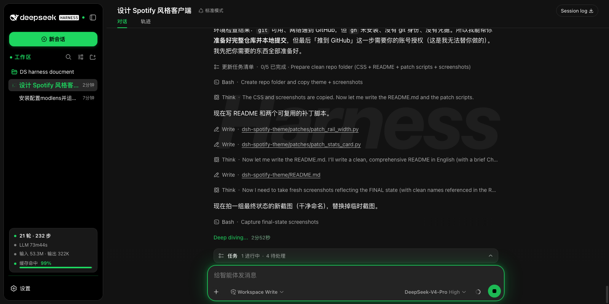
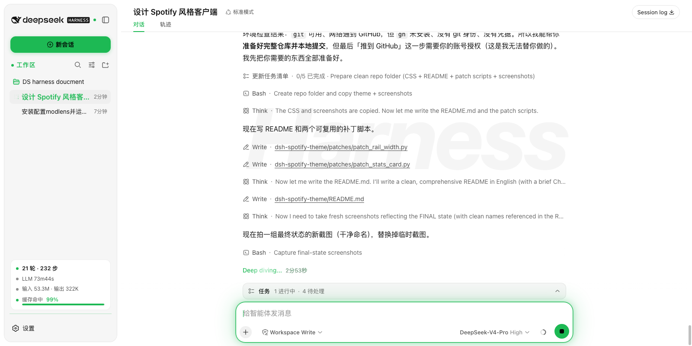
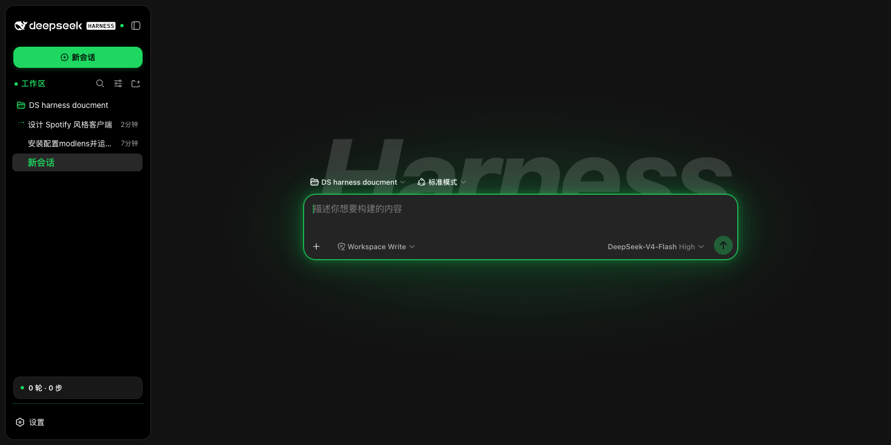
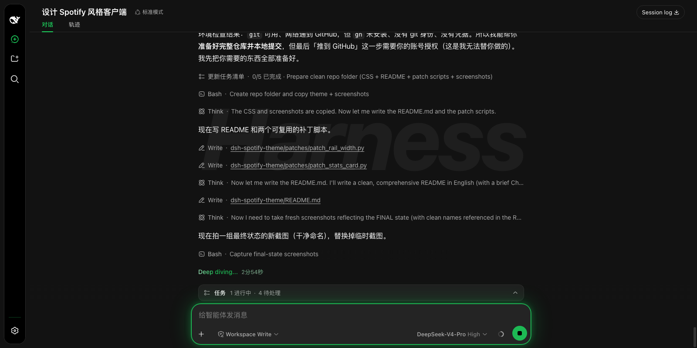

# DSH Spotify Theme

A Spotify-inspired restyle for the [DeepSeek Harness](https://github.com/deepseek-ai/deepseek-harness) web client — near-black surfaces, layered gray cards, white/gray text and the signature Spotify green (`#1ed760` / `#1db954`) accent. Ships as a single drop-in CSS override plus two tiny optional patches.

> 中文用户请看文末「快速安装」。

## Preview

| Dark | Light |
| --- | --- |
|  |  |

| Hero + watermark | Collapsed rail |
| --- | --- |
|  |  |

## Features

**Theming**
- Dark + light palettes sharing one structure (Spotify green accents in both)
- Full `--dsw-*` design-token override, so the palette flows through every component

**Sidebar**
- Floating rounded-rectangle panel with matching margins when collapsed
- Green "New Session" pill, green section headers with dots, green folder icons
- Active session highlighted in bold green
- "Now playing"-style breathing green dot on running sessions
- Redesigned session-stats card with a cache-hit progress bar

**Main area**
- Task title promoted to a real headline; workspace breadcrumb demoted
- Green diffuse focus halo on the composer
- User bubbles tinted green to separate them from assistant content
- Large italic "Harness" watermark behind the conversation
- Fade + rise transition on every session switch / new session

**Polish & accessibility**
- Smooth hover/focus transitions, `:focus-visible` green outline
- Respects `prefers-reduced-motion`

## Install

### 1. Copy the stylesheet

Find your installed dsh frontend dist. For an `npx` install it lives under
`~/.npm/_npx/*/node_modules/@deepseek-ai/dsh-web-frontend/dist/`.

```bash
DIST="$(ls -d ~/.npm/_npx/*/node_modules/@deepseek-ai/dsh-web-frontend/dist | head -1)"
cp spotify-theme.css "$DIST/assets/spotify-theme.css"
```

### 2. Link it

Append one `<link>` to `"$DIST/index.html"`, **after** the existing stylesheets:

```html
<link rel="stylesheet" crossorigin href="/assets/spotify-theme.css">
```

### 3. Restart / refresh

Refresh `http://127.0.0.1:3080/`. To revert, remove the `<link>` (or the file).

## Optional patches

Two optional patches enable the wider collapsed rail and the stats-card
progress bar (both require editing the bundled client JS). Run from this repo:

```bash
python3 patches/patch_rail_width.py
python3 patches/patch_stats_card.py
```

Each accepts an optional path to your `@deepseek-ai` directory:

```bash
python3 patches/patch_rail_width.py ~/.npm/_npx/<hash>/node_modules/@deepseek-ai
```

> These patches are written against **dsh `0.1.0-rc.7`**. The CSS relies on a
> few hashed CSS-module class names from that build; the `--dsw-*` token
> overrides are version-stable, but the component-level rules may need
> retargeting on future releases.

## Compatibility

- Tested with DeepSeek Harness **`0.1.0-rc.7`**
- No secrets, paths, or personal data are included — this repo is CSS + two
  small patch scripts only.

## License

Your own theme work is yours to license. The patches target DeepSeek Harness,
which is MIT-licensed; this repo is provided as-is without warranty.

---

## 快速安装（中文）

1. 把 `spotify-theme.css` 复制到 dsh 前端目录：
   ```bash
   DIST="$(ls -d ~/.npm/_npx/*/node_modules/@deepseek-ai/dsh-web-frontend/dist | head -1)"
   cp spotify-theme.css "$DIST/assets/spotify-theme.css"
   ```
2. 在 `"$DIST/index.html"` 里，于现有样式表之后加一行：
   ```html
   <link rel="stylesheet" crossorigin href="/assets/spotify-theme.css">
   ```
3. 刷新页面即可；删除该 `<link>` 即恢复原样。

可选补丁（加宽折叠栏 + 统计卡进度条）：
```bash
python3 patches/patch_rail_width.py
python3 patches/patch_stats_card.py
```
